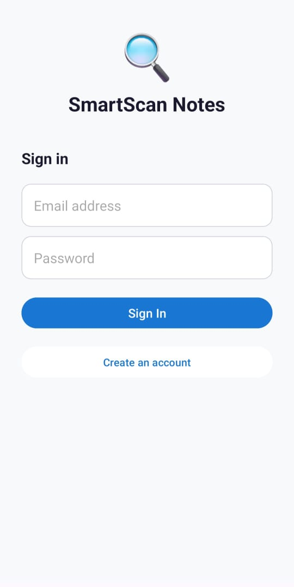
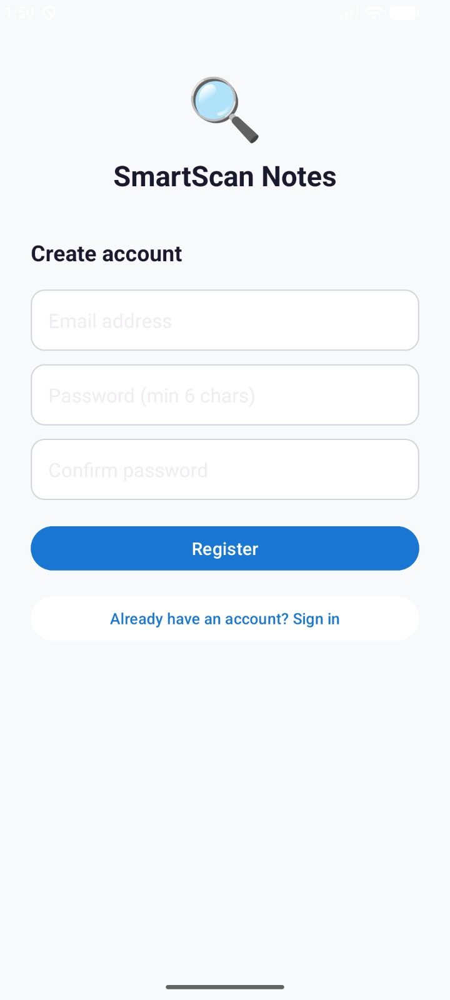
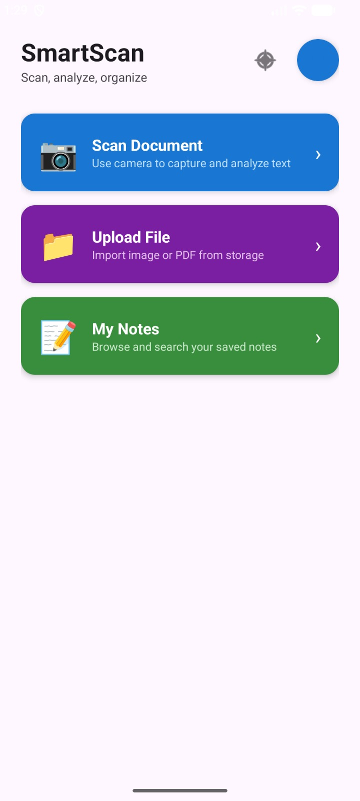
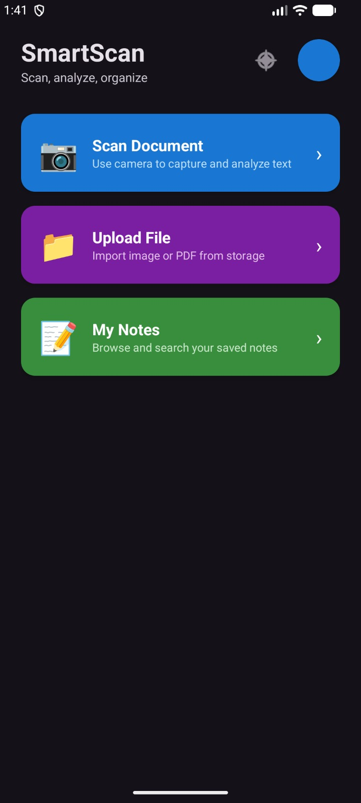
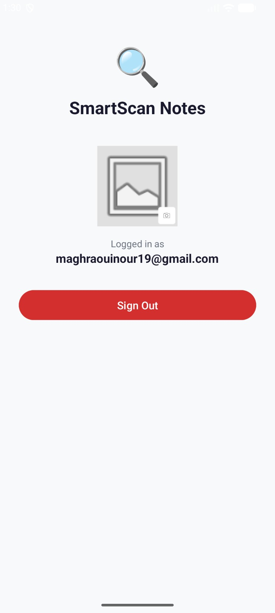
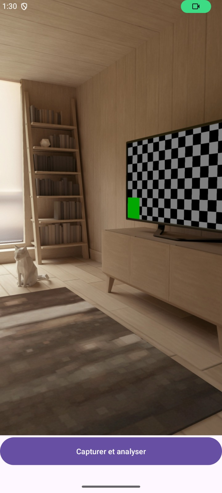
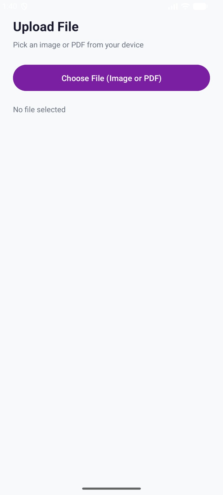
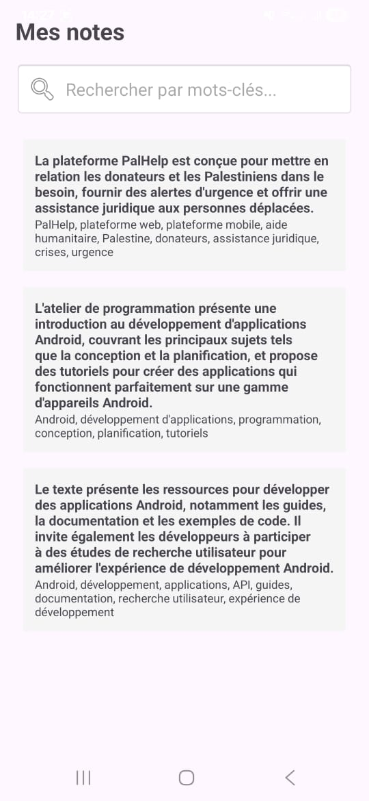

# 📸 NoteScanner AI

> Application Android académique de numérisation et d'analyse intelligente de documents par OCR et IA générative.

---

## 🧠 Description

**NoteScanner AI** est une application Android qui permet de capturer ou importer des documents (images, PDF), d'en extraire le texte via OCR (ML Kit), puis de générer automatiquement un **résumé** et des **mots-clés** grâce à l'API Groq (LLaMA 3.3 70B). Les notes sont ensuite sauvegardées localement et consultables à tout moment.

---

## ✨ Fonctionnalités

- 📷 **Scan par caméra** — Capture d'une photo et reconnaissance de texte en temps réel
- 📁 **Import de fichiers** — Chargement d'images ou de PDF depuis le stockage
- 🤖 **Analyse IA** — Résumé et extraction de mots-clés via LLaMA 3.3 (Groq API)
- 💾 **Sauvegarde locale** — Persistance des notes avec Room Database
- 🔍 **Recherche** — Filtrage des notes par contenu ou mots-clés
- 🔐 **Authentification** — Connexion / inscription via Firebase Auth
- 🖼️ **Profil utilisateur** — Photo de profil personnalisable
- 🌙 **Thème clair / sombre** — Bascule dynamique du thème

---

## 🛠️ Stack Technique

| Composant | Technologie |
|---|---|
| Langage | Java |
| UI | XML Layouts + RecyclerView |
| Caméra | CameraX |
| OCR | Google ML Kit (Text Recognition) |
| IA | Groq API — LLaMA 3.3 70B Versatile |
| Auth | Firebase Authentication |
| Base de données | Room (SQLite) |
| Réseau | Retrofit2 + OkHttp3 |
| Thème | AppCompatDelegate (Night Mode) |

---

## 📁 Architecture du projet

```
com.example.myapplication/
├── MainActivity.java               # Écran principal & navigation
├── UI/
│   ├── CaptureActivity.java        # Scan via caméra + OCR
│   ├── Uploadactivity.java         # Import fichier + OCR + analyse IA
│   ├── NoteDetailActivity.java     # Détail d'une note + appel Groq
│   ├── NotesListActivity.java      # Liste & recherche des notes
│   ├── Profileactivity.java        # Authentification & profil
│   └── GrokApi.java                # Interface Retrofit pour Groq
├── Data/
│   ├── NoteRepository.java         # Accès Room DB
│   └── AiRepository.java           # Modèles de requête/réponse Groq
└── Model/
    └── Note.java                   # Entité Room
```

---

## ⚙️ Installation & Configuration

### Prérequis

- Android Studio Hedgehog ou supérieur
- SDK Android 26+
- Compte [Firebase](https://console.firebase.google.com/)
- Clé API [Groq](https://console.groq.com/)

### 1. Cloner le dépôt

```bash
git clone https://github.com/<nourmaghraoui-a11>/notescanner-ai.git
cd notescanner-ai
```

### 2. Configurer Firebase

1. Créer un projet Firebase
2. Activer **Authentication → Email/Password**
3. Télécharger `google-services.json` et le placer dans `/app/`

### 3. Configurer la clé API Groq

Dans votre fichier `local.properties` (non versionné) :

```properties
GROK_API_KEY=votre_clé_api_groq_ici
```

Dans `build.gradle (app)`, assurez-vous que la clé est injectée via `BuildConfig` :

```gradle
android {
    defaultConfig {
        buildConfigField "String", "GROK_API_KEY", "\"${project.findProperty('GROK_API_KEY') ?: ''}\""
    }
}
```

### 4. Lancer le projet

Ouvrir dans Android Studio → **Run** ▶️

---

## 🔒 Sécurité & .gitignore

Les fichiers sensibles suivants sont **exclus du dépôt** :

```
local.properties          # Contient la clé API Groq
google-services.json      # Contient les credentials Firebase
*.jks / *.keystore        # Certificats de signature
.env                      # Variables d'environnement
```

> ⚠️ Ne jamais commiter une clé API directement dans le code source.

---
## Écrans de l'application

### Écran de connexion


### Écran de création de compte


### Accueil (mode clair)


### Accueil (mode sombre)


### Profil


### Scan


### Upload


### Notes


---


## 👨‍💻 Auteurs

Projet académique réalisé dans le cadre du cours **[developpement mobile]** — **[ISAMM]** — Année **2025/2026**.

---
